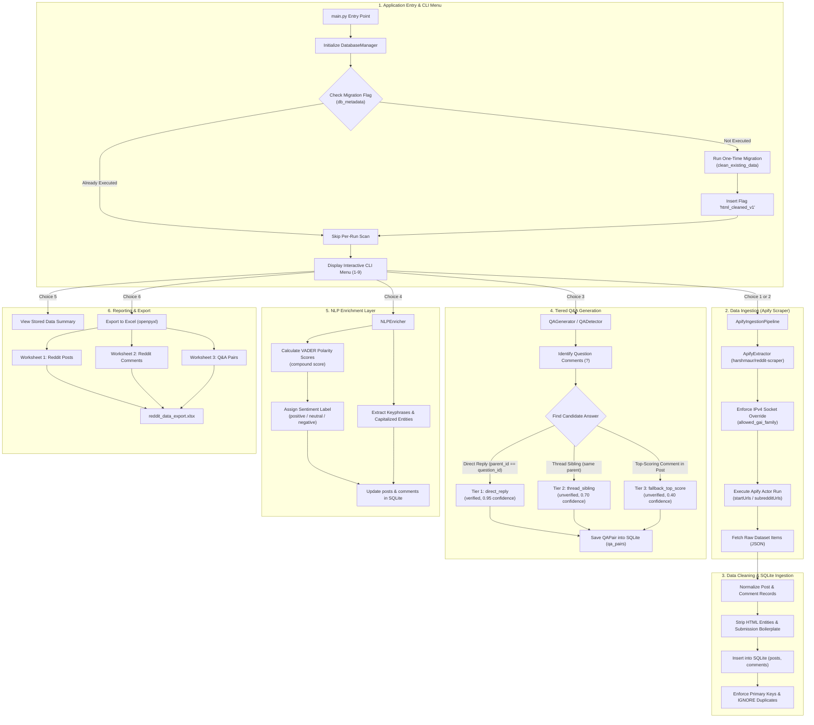
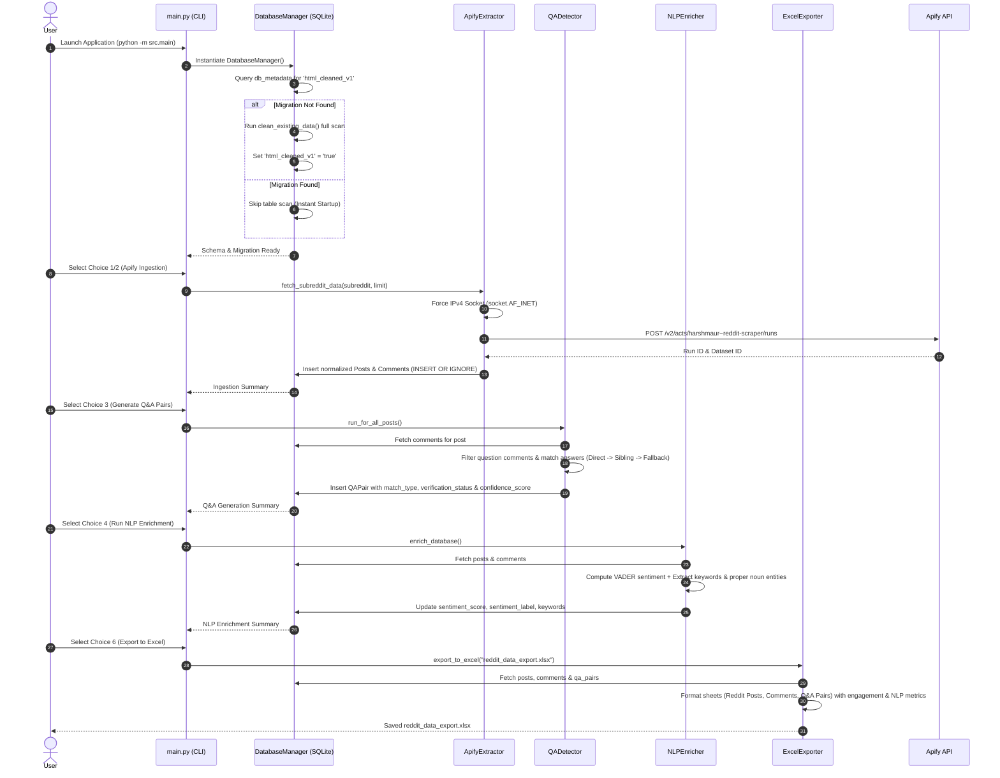

# Reddit Content Acquisition & NLP Enrichment Pipeline - Project Flow

This document provides a comprehensive end-to-end overview of the **Reddit Content Acquisition, Q&A Extraction, and NLP Enrichment** system architecture, data lifecycle, and internal execution flow.

---

## High-Level Architecture Flowchart

---

## Detailed Data Lifecycle & Processing Stages

---

## Detailed Step-by-Step Pipeline Description

### Phase 1: Application Entry & Migration Check
1. **Entry Point**: The user starts `python -m src.main`.
2. **`DatabaseManager` Setup**: Initializes the SQLite database file (`data/reddit_news.db`).
3. **Migration Check**: Queries table `db_metadata` for key `'html_cleaned_v1'`:
   - If missing: Executes `clean_existing_data()` once, unescaping HTML entities and stripping Reddit RSS taglines across pre-existing data, then sets key `'html_cleaned_v1' = 'true'`.
   - If present: Skips the table scan instantly, ensuring zero performance overhead on application startup.

---

### Phase 2: Ingestion & Raw Data Extraction
1. **Actor Configuration**: Connects to Apify using `APIFY_API_TOKEN` and `APIFY_ACTOR_ID` (default: `harshmaur/reddit-scraper`).
2. **Windows Network Resilience**: Applies an automatic socket patch (`urllib3.util.connection.allowed_gai_family = lambda: socket.AF_INET`) to force IPv4 DNS resolution, eliminating Windows IPv6 `getaddrinfo` timeouts (`Errno 11002`).
3. **Payload Dispatch**: Submits run configurations (`startUrls`, `maxPostsCount`, `crawlCommentsPerPost: True`, `maxCommentsPerPost`).
4. **Dataset Retrieval**: Fetches JSON items output by the actor.

---

### Phase 3: Text Cleaning & Normalization
1. **Field Mapping**: Maps raw JSON fields (`id`, `parsedId`, `title`, `body`, `authorName`, `upVotes`, `commentsCount`, `postUrl`, `createdAt`) into structured dataclasses (`RedditPost`, `RedditComment`).
2. **Text Normalization**:
   - Decodes HTML entities (e.g. `&#39;` → `'`, `&quot;` → `"`).
   - Strips Reddit RSS submission taglines (e.g. `submitted by /u/user [link] [comments]`).

---

### Phase 4: SQLite Database Ingestion & Deduplication
1. **Post Ingestion**: Executes `INSERT OR IGNORE INTO posts` using `post_id` as Primary Key.
2. **Comment Ingestion**: Executes `INSERT OR IGNORE INTO comments` using `comment_id` as Primary Key. Preserves relational foreign key `post_id`, parent link `parent_id` (`t1_` for comments, `t3_` for posts), engagement `score` (net upvotes), and thread `depth`.

---

### Phase 5: Tiered Q&A Generation & Reliability Tagging
1. **Question Isolation**: Identifies all comments containing question marks (`?`).
2. **3-Tier Answer Matching**:
   - **Tier 1 (`direct_reply`)**: Candidate comment `parent_id` matches the question comment `comment_id`. Assigned `verification_status: verified_direct_reply` and `confidence_score: 0.95`.
   - **Tier 2 (`thread_sibling`)**: Candidate comment shares the same `parent_id` within the discussion branch. Assigned `verification_status: unverified_thread_sibling` and `confidence_score: 0.70`.
   - **Tier 3 (`fallback_top_score`)**: Highest-scoring non-question comment available in the post. Assigned `verification_status: unverified_fallback` and `confidence_score: 0.40`.
3. **Deduplication & Sub-question Filter**: Ensures used answers are never assigned to multiple questions, and prevents questions from answering other questions.
4. **Storage**: Saves pairings into `qa_pairs` with composite primary key `(question_comment_id, answer_comment_id)`.

---

### Phase 6: Natural Language Processing (NLP Enrichment)
1. **VADER Sentiment Analysis**: Computes compound polarity score `[-1.0 to +1.0]` using `vaderSentiment` (with fallback lexicon support):
   - `compound >= 0.05`: `"positive"`
   - `compound <= -0.05`: `"negative"`
   - Otherwise: `"neutral"`
2. **Keyword & Proper Noun Entity Extraction**:
   - Cleans stopwords and computes word frequency rankings.
   - Extracts capitalized proper noun entities (e.g., product names, places, organizations).
3. **Database Update**: Stores `sentiment_score`, `sentiment_label`, and `keywords` into `posts` and `comments` tables.

---

### Phase 7: Reporting & Professional Excel Export
1. **Console Data Inspector (Option 5)**: Displays total counts, sample posts/comments with scores and sentiment labels, and sample Q&A pairs with match tiers and confidence ratings.
2. **Formatted Excel Export (Option 6)**: Builds `reddit_data_export.xlsx` using `openpyxl` containing 3 formatted tabs:
   - **Reddit Posts**: `post_id`, `subreddit`, `title`, `body`, `author`, `score`, `num_comments`, `sentiment_label`, `sentiment_score`, `keywords`, `url`, `created_utc`.
   - **Reddit Comments**: `comment_id`, `post_id`, `parent_id`, `author`, `body`, `score`, `depth`, `sentiment_label`, `sentiment_score`, `keywords`, `created_utc`.
   - **Q&A Pairs**: `question_comment_id`, `answer_comment_id`, `post_id`, `question`, `answer`, `score_signal`, `match_type`, `verification_status`, `confidence_score`.
